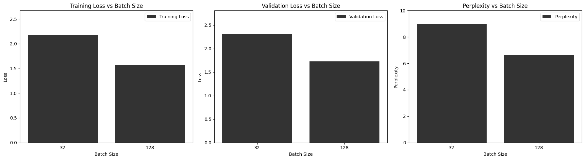
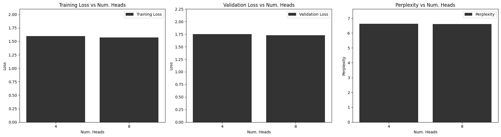

## **Results and Experiments**

The goal of this section is to test out different hyper-parameters to find the best parameters for the model. Those experiments also allow to see their effects on train, validation and test results. 

---

### **Table of Contents**

1. **Best Parameters**
2. **Regularization Techniques**
3. **Large Experiments (6000 Iterations)**
4. **Additional Experiments**
5. **Other experiments**

-----

### **1. Best Parameters**

The best val / train loss were achieved with the following:


| **Parameter**             | **Value** |
|----------------------------|-----------|
| **Batch size**             | 128       |
| **Block size**             | 128       |
| **Maximum iterations**     | 1400      |
| **Learning rate**          | 3e-4      |
| **Evaluation iterations**  | 100       |
| **Embedding size (n_embd)**| 512       |
| **Number of heads (n_head)**| 8         |
| **Number of layers (n_layer)**| 6        |
| **Dropout rate**           | 0.2       |


**Results at Optimal Point**

- **Training Loss**: 1.22
- **Validation Loss**: 1.62
- **Perplexity**: 5.52
- **Training Time (min)**: 18  


**Training and Validation Loss Plot**


**Output generated text** The rest can be found [here](../Documentation/generated_text.txt)

**Input sequence**
```
O God, O God!
```

**Generated Text:**
```
Generated Text:
O God, O God!

GLOUCESTER:
Prantagently, do that I know: consul
In the gates of appeal's a deep, that treater.

LADY CAPULET:
Romeo, come, my goods
Madam, my lord, all at greatermandancely.

Nurse:
Their wulls it subject a man; gentleman?

LADY CAPULET:
Thy lord? Saint Bolingbroke, is meet us the morrow;
For Gloucester's lord, your speak pention;
Let's so return blind him your day to-day.

HASTINGS:
Good's duke much forth, as I would say take there is.
...
```
---


### **2. Regularization Techniques**

Using the following changed parameter (maximum iterations = 600), we just add gradient clipping (max_norm=1) and scheduler.

**Training and Validation Loss Plot**

| **Metric**             | **Value**           |  
|-------------------------|---------------------|  
| Training Loss           | 1.68     |  
| Validation Loss         | 1.81     |  
| Perplexity              | 7.3      |  
| Training Time (min)     | 14       |  

**Results** This did not improve the results a lot, however, it is possible that adding more iterations might give better results at the end. This is because the scheduler might help the model converge to better results through more iterations. 

### **3. Large Experiments (6000 Iterations)**


| **Parameter**             |  **Value** |
|----------------------------|-----------|
| **Batch size**             | 128       |
| **Block size**             |  128       |
| **Maximum iterations**     |  6000      |
| **Learning rate**          |  3e-4      |
| **Evaluation iterations**  |  100       |
| **Embedding size (n_embd)**| 768       |
| **Number of heads (n_head)**|  8         |
| **Number of layers (n_layer)**|  12        |
| **Dropout rate**           |  0.2       |


**Loss (validation and training) plot**


**Results:** The training loss decreases steadily from **4.37** to **0.058**, showing that it fits the training data. However, the validation loss, plateaus around **1.65** before rising to **3.83**, indicating overfitting as the model begins to memorize the training data and fails to generalize. When the validation loss plateaus, it reflects the model's optimal performance for the given setup, and further training risks overfitting. Stopping at this point ensures good results and captures the essential patterns in the data. This is why we added the line that shows the optimal number of eval iterations for our model, set at 1400 iterations. The lowest training loss is 0.05, lowest validation loss 1.65, perplexity 7.08 and training time 5 hours. 


### **4. Additional Experiments**

All experiments were conducted with the following default parameters:


| **Parameter**             | **Value** |
|----------------------------|-----------|
| **Batch size**             | 128       |
| **Block size**             | 128       |
| **Maximum iterations**     | 600      |
| **Learning rate**          | 3e-4      |
| **Evaluation iterations**  | 50       |
| **Embedding size (n_embd)**| 512       |
| **Number of heads (n_head)**| 8         |
| **Number of layers (n_layer)**| 6        |
| **Dropout rate**           | 0.2       |


For this experiment, results are the following:

- **Val Train:** 1.57
- **Val Loss:** 1.73
- **Training Time:** 10.26
- **Perplexity:** 6.62 ± 1.3


---

**Experiment 1: Dropout Rates**

| **Dropout Rate** | **Training Loss** | **Validation Loss** | **Perplexity** | **Training Time (min)** | **GC / Cluster** |
|------------------|-------------------|---------------------|---------------|-------------------------|------------------|
| 0.0              | 1.36             | 1.61                | 5.97 ± 1.2     | 9.90                    | Cluster          |
| 0.2              | 1.57             | 1.73                | 6.62 ± 1.3     | 10.26                   | Cluster  |
| 0.5              | 2.09             | 2.18                | 9.00 ± 1.19    | 10.01                   | Cluster          |


**No Dropout (0.0)**:  
- Training loss: **1.36**, Validation loss: **1.61**, Perplexity: **5.97**.  
- Lowest values but overfitting occurs as the model memorizes training data.

**Dropout 0.2**:  
- Training loss: **1.57**, Validation loss: **1.73**, Perplexity: **6.62**.  
- Best generalization

**Dropout 0.5**:  
- Training loss: **2.09**, Validation loss: **2.18**, Perplexity: **9.00**.  
- Highest losses and perplexity, indicating underfitting due to excessive regularization.

**Conclusion**:  
- Dropout 0.2 achieves the best balance.  
- No dropout (0.0) overfits, and dropout 0.5 underfits.

---


**Experiment 2: Batch Size** 
| **Batch Size** | **Training Loss** | **Validation Loss** | **Perplexity** | **Training Time (min)** | **GC / Cluster** |
|------------------|-------------------|---------------------|---------------|-------------------------|------------------|
| 32               | 2.17             | 2.31                 | 9.00 ± 1.7         | 5.78               | Cluster          |
| 128              | 1.57             | 1.73                 |  6.62 ± 1.3    | 10.26                  | Cluster          |




**Batch Size 32**:

   - Higher training loss (**2.17**) and validation loss (**2.31**) 
   - Perplexity is higher (**9.00**), reflecting reduced predictive performance.

**Batch Size 128**:

   - Lower training loss (**1.57**) and validation loss (**1.73**) compared to batch size 32
   - Perplexity is significantly lower (**6.62**), showing better predictive quality.


**Conclusion**:
- **Batch Size 32** Faster but less stable training and generalization
- **Batch Size 128** Better balance between training loss, validation loss, and generalization

---

**Experiment 3: Number of layers** 

| **Num Layers** | **Training Loss** | **Validation Loss** | **Perplexity** | **Training Time (min)** | **GC / Cluster** |
|------------------|-------------------|---------------------|---------------|-------------------------|------------------|
| 6              | 1.57             | 1.73                 |  6.62 ± 1.3    | 10.26                  | Cluster          |
| 12              | 1.85             | 2.05                | 7.05  ± 1.1          | 16.36                     | Cluster  |


**6 Layers**:  
- Training loss: **1.57**, Validation loss: **1.73**, Perplexity: **6.62**.  
- Better loss and perplexity with shorter training time.

**12 Layers**:  
- Training loss: **1.85**, Validation loss: **2.05**, Perplexity: **7.05**.  
- Higher loss and perplexity with significantly longer training time.

**Conclusion**:  
- **6 layers** provide better performance and efficiency compared to 12 layers
- Task is not very complicated and many layers seems less necessary.

---


**Experiment 4: Embedding size** 

This experiment investigates the effect of different dropout rates on model performance. The results are summarized below:

| **Embedding Dim** | **Training Loss** | **Validation Loss** | **Perplexity** | **Training Time (min)** | **GC / Cluster** |
|------------------|-------------------|---------------------|---------------|-------------------------|------------------|
| 512              | 1.57             | 1.73                 |  6.62 ± 1.3    | 10.26                  | Cluster          |
| 768              | 1.56             | 1.75                | 6.67 ± 1.2     | 18.5                     | Cluster  |


**512 Embed. Size**:  
- Training loss: **1.57**, Validation loss: **1.73**, Perplexity: **6.62**.  
- Good balance of performance and training efficiency.

**768 Embed Size**:  
- Training loss: **1.56**, Validation loss: **1.75**, Perplexity: **6.67**.  
- Slightly worse performance but with significantly longer training time.

**Conclusion**:  
- Increasing hidden size (768) provides marginal improvements in loss and perplexity and at the cost of **almost double the training time**.  512 Embed Size better tradeoff between performance and efficiency.

---

**Experiment 5: Number of Heads** 

This experiment investigates the effect of different number of heads on model performance. The results are summarized below:

| **Num Heads** | **Training Loss** | **Validation Loss** | **Perplexity** | **Training Time (min)** | **GC / Cluster** |
|------------------|-------------------|---------------------|---------------|-------------------------|------------------|
| 4             | 1.60             | 1.75                 | 6.60 ± 1.2    | 8.90                    | Cluster          |
| 8             | 1.57             | 1.73                 |  6.62 ± 1.3    | 10.26                  | Cluster          |



**4 Heads**:  
- Training loss: **1.60**, Validation loss: **1.75**, Perplexity: **6.60**.  
- Slightly higher loss and perplexity compared to 8 heads.

**8 Heads**:  
- Training loss: **1.57**, Validation loss: **1.73**, Perplexity: **5.62**.  
- Slightly better loss and perplexity 

**Conclusion**:  
- Increasing the number of heads (8) improves performance slightly.  

--- 

### **5. Other Experiments**

The table below illustrates a few different experiments that were made:


| **Experiment** | **Training Loss** | **Validation Loss** | **Perplexity** | **Training Time (min)**
|------------------|-------------------|---------------------|---------------|------------------------
| Post-Norm        | 1.50              | 1.67                | 6.26 ± 1.2     | 10.0                
| Deleting ReLU    | 1.86              | 1.96                | 7.62 ± 1.1     | 9.90             
| Disable Attention Mask | 0.01              | 0.02             | 1.02                | 9.92 
| Initialize small weights  (std: 0.001)  | 2.04             | 2.10                | 8.1 ± 1.17    | 9.97

